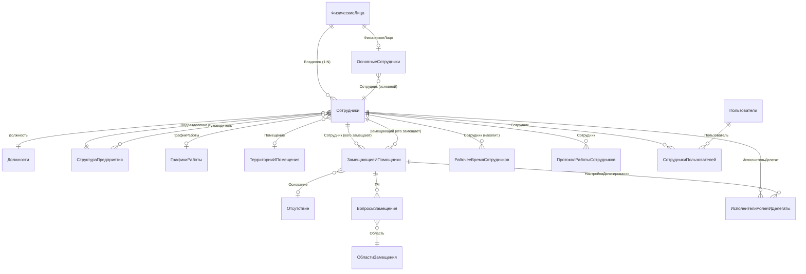

# Справочник Сотрудники: структура, связи, замещение, регистры

**Конфигурация:** 1С:Документооборот КОРП 3.0 (v3.0.14.31)  
**Дата анализа:** 2026-04-08  
**Источник:** MCP-сервер rlm-tools-bsl, проект "Тест ДО3"  
**Тест:** TEST-06, сессия 120dbfbdb51e

---

## 1. Реквизиты справочника Сотрудники

Справочник `Catalogs.Сотрудники` является **подчинённым** справочнику `ФизическиеЛица` (через стандартный реквизит **Владелец** типа `CatalogRef.ФизическиеЛица`). Наименование элемента автоматически заполняется как `Строка(Владелец)`, то есть совпадает с ФИО физического лица.

### 1.1 Реквизиты заголовка (9 шт.)

| Имя | Синоним | Тип |
|-----|---------|-----|
| Владелец (стандартный) | Физическое лицо | `CatalogRef.ФизическиеЛица` |
| Должность | Должность | `CatalogRef.Должности` |
| Подразделение | Подразделение | `CatalogRef.СтруктураПредприятия` |
| ГрафикРаботы | График работы | `CatalogRef.ГрафикиРаботы` |
| Помещение | Помещение | `CatalogRef.ТерриторииИПомещения` |
| ДатаНачалаДействия | Дата начала действия | `DateTime` |
| ДатаОкончанияДействия | Дата окончания действия | `DateTime` |
| Действует | Действует | `Boolean` |
| ПредставлениеВДокументах | Представление в документах | `String` |
| ПредставлениеВПереписке | Представление в переписке | `String` |

> Реквизит **Действует** вычисляется автоматически при записи исходя из дат начала/окончания: сотрудник действует, если ДатаНачала ≤ ТекущаяДата ≤ ДатаОкончания (или ДатаОкончания не заполнена).

### 1.2 Табличные части (2 шт.)

**ТЧ КонтактнаяИнформация** (10 колонок):

| Колонка | Тип |
|---------|-----|
| Тип | `EnumRef.ТипыКонтактнойИнформации` |
| Вид | `CatalogRef.ВидыКонтактнойИнформации` |
| Представление | `String` |
| ЗначенияПолей | `String` |
| Страна | `String` |
| Регион | `String` |
| Город | `String` |
| АдресЭП | `String` |
| НомерТелефона | `String` |
| НомерТелефонаБезКодов | `String` |
| ДоменноеИмяСервера | `String` |
| ВидДляСписка | `CatalogRef.ВидыКонтактнойИнформации` |
| Значение | `String` |

**ТЧ ДополнительныеРеквизиты** (3 колонки):

| Колонка | Тип |
|---------|-----|
| Свойство | `ChartOfCharacteristicTypesRef.ДополнительныеРеквизитыИСведения` |
| Значение | (составной тип) |
| ТекстоваяСтрока | `String` |

---

## 2. Связи с другими справочниками

### 2.1 ФизическиеЛица

Связь **один-к-многим**: одному физическому лицу может соответствовать несколько элементов справочника Сотрудники (например, совместительство или повторный приём).

**Архитектура связи:**
- `Сотрудники.Владелец` = `CatalogRef.ФизическиеЛица` — основная ссылка
- Функция `ФизЛицоСотрудника(Сотрудник)` возвращает `ОбщегоНазначения.ЗначениеРеквизитаОбъекта(Сотрудник, "Владелец")`
- Регистр сведений **ОсновныеСотрудники** (измерение: ФизическоеЛицо → ресурс: Сотрудник) хранит «основного» сотрудника для каждого физлица
- При изменении признака `Действует` вызывается `ПодобратьИУстановитьОсновногоСотрудника(ФизическоеЛицо)`, который автоматически выбирает первого из действующих сотрудников физлица

**Справочник ФизическиеЛица** содержит собственные реквизиты: ДатаРождения, ИНН, СНИЛС, Пол, ФайлФотографии, Комментарий, ГруппаДоступа.

### 2.2 Должности

- `Сотрудники.Должность` = `CatalogRef.Должности`
- Справочник Должности прост: содержит только наименование + 1 кастомный реквизит Тест: `тст_ТиповаяПечатнаяФорма`
- При изменении должности у сотрудника обновляются данные документов предприятия (через `Делопроизводство.ЗаписатьДанныеДокументовПредприятия_ПереименованиеАдресата`)

### 2.3 СтруктураПредприятия

- `Сотрудники.Подразделение` = `CatalogRef.СтруктураПредприятия`
- Обратная ссылка: `СтруктураПредприятия.Руководитель` = `CatalogRef.Сотрудники` — руководитель подразделения
- Справочник СтруктураПредприятия имеет иерархию; функция `БлижайшийРуководитель(Сотрудник)` обходит иерархию вверх через `Родитель` до первого подразделения с заполненным руководителем и действующим пользователем

---

## 3. Механизм замещения сотрудников

### 3.1 Ключевые объекты

**Справочник `ЗамещающиеИПомощники`** — центральный объект механизма замещения.

Реквизиты заголовка:

| Реквизит | Тип | Описание |
|----------|-----|----------|
| Сотрудник | `CatalogRef.Сотрудники` | Кого замещают / кому помогают |
| Замещающий | `CatalogRef.Сотрудники` | Кто замещает / помогает |
| ВидЗамещения | `EnumRef.ВидыЗамещения` | Замещающие / Помощники |
| ДатаНачала | `DateTime` | Начало действия |
| ДатаОкончания | `DateTime` | Окончание (пустая = бессрочно) |
| Действует | `Boolean` | Вычисляется автоматически по датам |
| Основание | `DocumentRef.Отсутствие` | Документ-основание (отсутствие) |
| Создал | `CatalogRef.Сотрудники` | Кто создал запись |
| Комментарий | `String` | Произвольный комментарий |

**ТЧ ВопросыЗамещения**:

| Колонка | Тип |
|---------|-----|
| Область | `CatalogRef.ОбластиЗамещения` |
| ЗначениеОтбора | (составной тип) |

**Перечисление ВидыЗамещения:**
- `Замещающие` — замещающий исполняет задачи вместо сотрудника
- `Помощники` — помощник помогает сотруднику

**Справочник ОбластиЗамещения** — настраиваемый список областей (типов задач), по которым может быть ограничено замещение (реквизит: Порядок).

### 3.2 Где реализован механизм

1. **ObjectModule `ЗамещающиеИПомощники`:**
   - `ПередЗаписью`: автовычисление `Действует` = (ДатаНачала ≤ Сейчас ≤ ДатаОкончания), формирование наименования `"Замещающий за/для Сотрудник"`
   - `ПриЗаписи`: при изменении ключевых реквизитов запускает `ОбновитьДанныеЗадачПоЗамещению` (через очередь заданий или напрямую) + регистрирует бизнес-события

2. **ManagerModule `ЗамещающиеИПомощники`** (9 экспортных функций):
   - `АктуальныеЗамещения(Кому, ОбластиЗамещения)` — замещения ДЛЯ указанного сотрудника (он замещает кого-то)
   - `АктуальныеЗамещенияСотрудников(СотрудникиМассив, ОбластиЗамещения)` — кто замещает указанных сотрудников
   - `ВсеЗамещенияПоДействиямЗадач` — с фильтрацией по типам задач
   - `ВидыЗадачДокументовПоОбластямЗамещения` — маппинг областей → виды задач
   - `ОбновитьДанныеЗадачПоЗамещению` — пересчёт задач при изменении замещения

3. **Регистр сведений `ИсполнителиРолейИДелегаты`:**
   - Измерения: ИсполнительДелегат (Сотрудники|Пользователи), РольСотрудник (Сотрудники|ПолныеРоли|Пользователи), НастройкаДелегирования (ЗамещающиеИПомощники), ИмяОбластиДелегирования
   - Обновляется при записи сотрудника: `РегистрыСведений.ИсполнителиРолейИДелегаты.ОбновитьЗаписиПоСотруднику(Ссылка)`
   - Обеспечивает быстрый поиск делегатов при адресации задач

4. **Документ `Отсутствие`** — может служить основанием для создания замещения:
   - Имеет реквизит `Сотрудник` и ТЧ `УдалитьЗаместители`
   - Когда документ Отсутствие помечается на удаление, автоматически помечается связанное замещение

---

## 4. Регистры, хранящие данные о сотрудниках

### 4.1 Регистры сведений (10 шт.)

| Регистр | Синоним | Назначение |
|---------|---------|------------|
| **ОсновныеСотрудники** | Основные сотрудники | ФизическоеЛицо → основной Сотрудник |
| **СотрудникиПользователей** | Сотрудники пользователей | Пользователь ↔ Сотрудник (M:M) |
| **ИсполнителиРолейИДелегаты** | Исполнители ролей и делегаты | Делегирование задач через замещение |
| **ПолномочияСотрудников** | Полномочия сотрудников | Владелец → ПрофильГруппыДоступа |
| **ПротоколРаботыСотрудников** | Протокол работы сотрудников | Аудит действий (Дата, Объект, Сотрудник, ТипСобытия) |
| **СотрудникиВКонтейнерах** | Сотрудники в контейнерах | Принадлежность сотрудника контейнеру (папке) |
| **СотрудникиДляКонтроляСамочувствия** | Сотрудники для контроля самочувствия | Список подлежащих мониторингу |
| **ДоступноеВремяСотрудников** | (устарел) Доступное время | Расписание по дням недели |
| **ЗанятостьСотрудников** | (устарел) Занятость | Периоды занятости с состоянием |
| **НастройкиРабочегоКалендаряСотрудника** | (устарел) Настройки рабочего календаря | Настройки доступности |
| **ДанныеSAPСотрудники** | Данные SAP (сотрудники) | Кэш данных из SAP: ФИО, должность, подразделение, ИНН, ПФР, контакты |

### 4.2 Накопительный регистр

| Регистр | Синоним | Назначение |
|---------|---------|------------|
| **РабочееВремяСотрудников** | Рабочее время сотрудников | Учёт фактических трудозатрат |

**Измерения** РабочееВремяСотрудников:
- Сотрудник (`CatalogRef.Сотрудники`)
- ВидРабот (`CatalogRef.ВидыРабот`)
- Источник (документ/объект: ВходящееПисьмо, ЕжедневныйОтчёт, Файлы, Проекты и т.д.)
- Проект (`CatalogRef.Проекты`)
- ПроектнаяЗадача (`CatalogRef.ПроектныеЗадачи`)

**Ресурсы:** ДлительностьВсего, ДлительностьРабочая, ДлительностьВВыходные, ДлительностьСверхурочно

**Авторы записей:** ЕжедневныйОтчет, ЕженедельныйОтчет

---

## 5. Ключевые модули подсистемы Сотрудники

| Модуль | Тип | Назначение |
|--------|-----|------------|
| `CommonModules/Сотрудники` | Серверный | 116 экспортных функций: ПользователиСотрудника, СотрудникиПользователей, БлижайшийРуководитель, ФизЛицоСотрудника, ЭтоПолноправныйСотрудник и др. |
| `CommonModules/СотрудникиКлиент` | Клиентский | Клиентские утилиты |
| `CommonModules/СотрудникиКлиентСервер` | Клиент+Сервер | Общие функции |
| `CommonModules/СотрудникиВызовСервера` | Вызов сервера | Клиентские вызовы серверных функций |
| `CommonModules/СотрудникиПовтИсп` | Повторное использование | Кэшируемые функции |
| `CommonModules/СотрудникиСобытия` | События | Обработчики событий подписок |

---

## 6. Диаграмма связей (Mermaid)

---

## 7. Выводы

1. **Архитектура "Физлицо → Сотрудники":** один человек может иметь несколько записей в справочнике Сотрудники (внешнее совместительство, повторный приём). Основной сотрудник определяется через регистр ОсновныеСотрудники.

2. **Связи со структурой предприятия двунаправленные:** Сотрудник принадлежит Подразделению, а Подразделение ссылается на своего Руководителя (также Сотрудника). Поиск руководителя идёт по иерархии вверх.

3. **Механизм замещения гибкий:** поддерживает два вида (Замещающие / Помощники), ограничение по областям деятельности, автоматическое управление признаком `Действует` по датам, связь с документом Отсутствие как основанием.

4. **Замещение влияет на адресацию задач** через регистр ИсполнителиРолейИДелегаты — он перестраивается при каждом изменении замещения и при записи сотрудника.

5. **Тест не вносил кастомных изменений** в справочник Сотрудники (find_custom_modifications вернул пустой результат), за исключением одного реквизита в справочнике Должности (`тст_ТиповаяПечатнаяФорма`).

6. **Устаревшие регистры** (ДоступноеВремяСотрудников, ЗанятостьСотрудников, НастройкиРабочегоКалендаряСотрудника) помечены "(будет удален в будущих версиях)" — не следует использовать в новых разработках.
