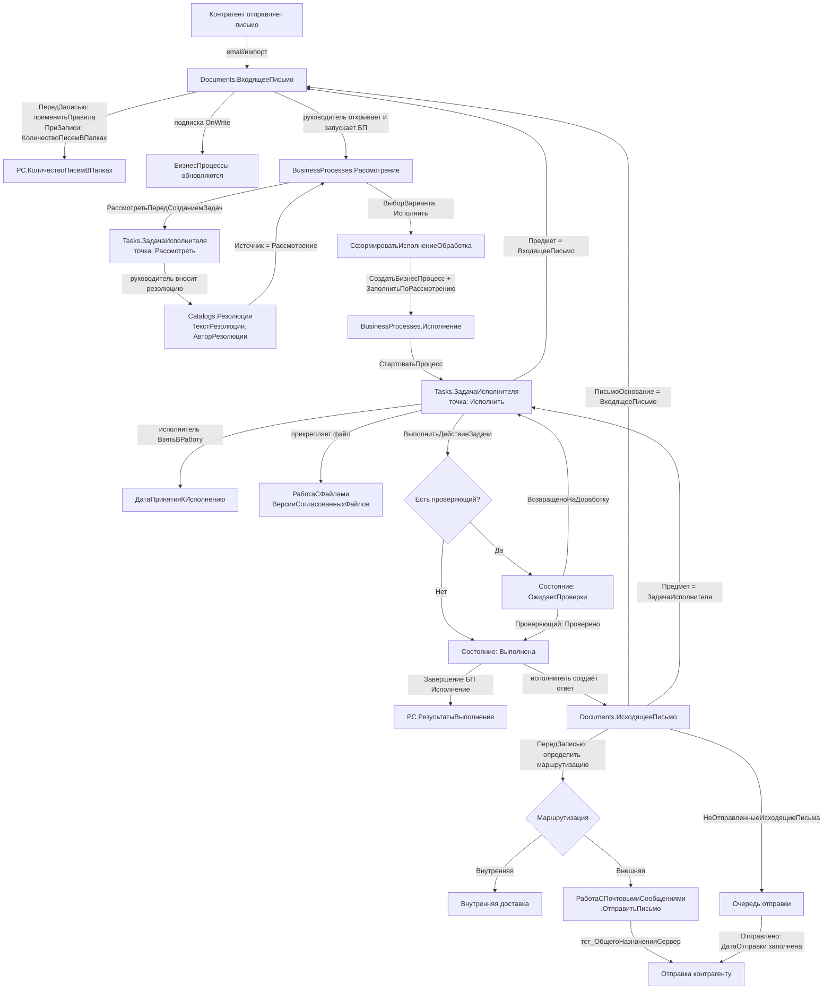

# Сквозной бизнес-сценарий: ВходящееПисьмо → Резолюция → Задача → ИсходящееПисьмо
**Конфигурация:** 1С:Документооборот КОРП 3.0 (ДокументооборотКОРП v3.0.14.31)  
**Проект:** Тест ДО3  
**Дата анализа:** 2026-04-08  
**Источник:** rlm-tools-bsl (прямой анализ кода)

---

## Обзор сквозного сценария

```
ВходящееПисьмо (поступает)
    ↓ [БП Рассмотрение запускается руководителем]
Справочник.Резолюции (фиксируется резолюция)
    ↓ [по варианту резолюции "Исполнить"]
БП Исполнение (создаётся и стартует)
    ↓ [создание задачи исполнителям]
ЗадачаИсполнителя (выполняется + прикрепляется файл)
    ↓ [исполнитель создаёт ответ]
ИсходящееПисьмо (отправляется контрагенту)
```

---

## Шаг 1: Поступление ВходящегоПисьма

### Объект
**Documents.ВходящееПисьмо**

### Ключевые реквизиты
| Реквизит | Тип | Назначение |
|----------|-----|------------|
| Папка | CatalogRef.ПапкиПисем | Обязательный, без него запись невозможна |
| Предмет | TaskRef.ЗадачаИсполнителя / CatalogRef.Проекты и др. | Связь с предметом переписки |
| ОтправительАдресат | CatalogRef.АдресатыПочтовыхСообщений | Контрагент-отправитель |
| УчетнаяЗапись | CatalogRef.УчетныеЗаписиЭлектроннойПочты | Почтовый ящик получателя |
| ТекстПисьмаHTMLХранилище | ValueStorage | Тело письма (HTML) |
| ДатаПолучения | DateTime | Метка времени получения |

**Табличные части:** ПолучателиПисьма, ПолучателиКопий, ПолучателиОтвета, АдресаУведомленияОПрочтении

### Модули
- `Documents/ВходящееПисьмо/Ext/ObjectModule.bsl` — объектный модуль
- `Documents/ВходящееПисьмо/Ext/ManagerModule.bsl` — менеджер (ПолучитьПоляДоступа, ПолучитьПравилаОбработкиНастроекПравПапки)
- `Documents/ВходящееПисьмо/Forms/ФормаДокумента/...` — форма пользователя

### Процедуры ObjectModule
**ПередЗаписью** (`стр. 5-47`):
- Применение правил почтового ящика: `ВстроеннаяПочтаСервер.ПрименитьПравила(ЭтотОбъект)`
- Обработка смены папки (контроль прав)
- Пометка удаления приложенных файлов: `РаботаСФайламиВызовСервера.ПометитьНаУдалениеПриложенныеФайлы()`
- Проверка заполненности Папки — при пустой: `Отказ = Истина`

**ПриЗаписи** (`стр. 49-107`):
- Обновление счётчика писем: `РегистрыСведений.КоличествоПисемВПапках.ОчиститьЗаписиПоПапке()`
- Протоколирование: `ПротоколированиеРаботыСотрудников.ЗаписатьПометкуУдаления()`
- Расширение рабочей группы предмета по адресатам письма: `РаботаСРабочимиГруппами.ДобавитьУчастникаВТаблицуНабора()`

### Подписки на события (15 активных)
| Событие | Обработчик |
|---------|------------|
| BeforeWrite | ДокументооборотПраваДоступа.ДокументооборотПраваДоступаПередЗаписьюДокумента |
| OnWrite | ДокументооборотПраваДоступа.ДокументооборотПраваДоступаПриЗаписиОбъектаДоступа |
| BeforeWrite | ДействияСобытия.ДействияПередЗаписью |
| OnWrite | ДействияСобытия.ДействияПриЗаписи |
| OnWrite | РаботаСБизнесПроцессамиВызовСервера.БизнесПроцессПриЗаписиПриЗаписи |
| BeforeWrite | РаботаСФайлами.ВыполнитьДействияПередЗаписьюПрисоединенногоФайла |
| OnWrite | РаботаСФайлами.ВыполнитьДействияПриЗаписиПрисоединенногоФайла |
| OnWrite | БизнесСобытияСобытия.БизнесСобытияПриЗаписиБизнесПроцессаПриЗаписи |
| OnWrite | БизнесПроцессыИЗадачиСобытия.ЗадачиСПодзадачамиПриЗаписиБизнесПроцессаПриЗаписи |
| BeforeWrite | ОбменДаннымиСобытия.ВключитьИспользованиеПланаОбмена |

### Регистры
| Регистр | Тип | Операция |
|---------|-----|----------|
| КоличествоПисемВПапках | РС | Очистка/пересчёт при смене папки |

---

## Шаг 2: Рассмотрение руководителем и Резолюция

### Объект
**BusinessProcesses.Рассмотрение** — бизнес-процесс рассмотрения документа

### Ключевые реквизиты
| Реквизит | Тип | Назначение |
|----------|-----|------------|
| ВариантРассмотрения | Enum.ВариантыРассмотрения | Рассмотреть / Ознакомиться |
| ВариантОбработкиРезолюции | Enum.ВариантыОбработкиРезолюции | Исполнить / Ознакомить / Только резолюция |
| Исполнитель | CatalogRef.Сотрудники | Кто рассматривает |
| ГлавнаяЗадача | TaskRef.ЗадачаИсполнителя | Задача в маршруте |
| Резолюция | CatalogRef.Резолюции | Ссылка на оформленную резолюцию |

### Справочник Резолюции
**Catalogs.Резолюции** — хранит текст и метаданные резолюции

| Реквизит | Тип |
|----------|-----|
| АвторРезолюции | CatalogRef.Сотрудники |
| ТекстРезолюции | String |
| ДатаРезолюции | DateTime |
| Документ | CatalogRef.ДокументыПредприятия |
| Источник | **BusinessProcessRef.Рассмотрение** |
| Подписана | Boolean |
| ВнесРезолюцию | CatalogRef.Сотрудники (кто фактически внёс) |

**Модули:** `Catalogs/Резолюции/Ext/ObjectModule.bsl`, `Catalogs/Резолюции/Ext/ManagerModule.bsl`

### Процедуры ObjectModule БП Рассмотрение
**РассмотретьПередСозданиемЗадач** (`стр. 1202-1241`):
Создаёт задачу для руководителя:
```bsl
Задача = Задачи.ЗадачаИсполнителя.СоздатьЗадачу()
Задача.РезультатВыполнения = Резолюция  // ссылка на Справочник.Резолюции
Задача.Исполнитель = Исполнитель
СрокиИсполненияПроцессов.ЗаполнитьСрокИсполненияЗадачи(...)
```

**ВыборВариантаОбработкиРезолюцииОбработкаВыбораВарианта** (`стр. 1362-1372`):
Маршрутизация по результату рассмотрения — выбор варианта дальнейшей обработки.

**СформироватьИсполнениеОбработка** (`стр. 1374-1395`):
При варианте "Исполнить" создаёт БП Исполнение:
```bsl
ИсполнениеОбъект = БизнесПроцессы.Исполнение.СоздатьБизнесПроцесс()
ИсполнениеОбъект.ЗаполнитьПоРассмотрению(ЭтотОбъект)
ИсполнениеОбъект.Состояние = Перечисления.СостоянияБизнесПроцессов.Активен
ИсполнениеОбъект.Записать()
СтартПроцессовСервер.СтартоватьПроцесс(ИсполнениеОбъект)
```

### Регистры
| Регистр | Тип | Операция |
|---------|-----|----------|
| ИсторияЗадач | РС | Запись контекста выполнения |
| ДанныеБизнесПроцессов | РС | Метаданные: Автор, Дата, Завершен, ОсновнойПредмет |

---

## Шаг 3: Создание Задачи на исполнение

### Объект
**BusinessProcesses.Исполнение** + **Tasks.ЗадачаИсполнителя**

### Ключевые реквизиты БП Исполнение
| Реквизит | Тип |
|----------|-----|
| ВариантИсполнения | Enum.ВариантыМаршрутизацииЗадач (Параллельно/Последовательно/Смешанно) |
| Исполнители | ТЧ с колонками Исполнитель, ЗадачаИсполнителя, Пройден |
| Контролер / Проверяющий | CatalogRef.Сотрудники |
| РезультатыИсполнения | ТЧ: НомерИтерации, ЗадачаИсполнителя |

### Процедуры ObjectModule БП Исполнение
**ЗаполнитьПоРассмотрению** (`стр. 478-537`, экспорт):
Копирует из Рассмотрения: Автор, Наименование, Контролер, Проверяющий, Исполнители, Сроки, Важность, Проект

**ИсполнитьПередСозданиемЗадач** (`стр. 1961-2039`):
Создаёт ЗадачаИсполнителя для каждого исполнителя:
- Параллельно — задачи всем сразу
- Последовательно — задача первому непройденному
- Смешанно — с учётом ПорядокВыполнения

### Реквизиты ЗадачаИсполнителя (Tasks.ЗадачаИсполнителя)
| Реквизит | Тип | Назначение |
|----------|-----|------------|
| Автор | CatalogRef.Сотрудники | Инициатор |
| Исполнитель / РольИсполнителя | — | Кто выполняет |
| ФактическийИсполнитель | CatalogRef.ФактическиеИсполнители | Кто фактически выполнил |
| СрокИсполнения | DateTime | Срок |
| РезультатВыполнения | String | Текст результата/резолюции |
| Предмет | **DocumentRef.ВходящееПисьмо** / DocumentRef.ИсходящееПисьмо / ... | Предмет задачи |
| СостояниеБизнесПроцесса | Enum.СостоянияБизнесПроцессов | Активен/Завершён |
| ПринятаКИсполнению | Boolean | Статус принятия |

**Предмет задачи включает DocumentRef.ВходящееПисьмо** — прямая связь с источником.

### Процедуры модуля РаботаСЗадачами
**ВыполнитьДействиеЗадачи** (`стр. 1227`, экспорт):
Переводит задачу по состояниям:
- `Выполнена` → `ОжидаетПроверки` (если есть проверяющий)
- `Проверено` → завершение
- `ВозвращеноНаДоработку` → повторная итерация

**ВзятьВРаботу** (`стр. 742`) — фиксация принятия задачи.

### Регистры
| Регистр | Тип | Операция |
|---------|-----|----------|
| КоличествоЗадач | РН | Учёт задач пользователя |
| КоличествоДействийЗадач | РН | Учёт действий по задачам |
| ВсеИсполнителиДействийЗадач | РС | Матрица действие→исполнитель |
| ИсторияЗадач | РС | История изменений состояний |
| РезультатыВыполненияПроцессовИЗадач | РС | Итоги выполнения |
| РабочееВремяСотрудников | РН | Трудозатраты |

---

## Шаг 4: Выполнение задачи исполнителем (прикрепление файла)

### Процесс
Исполнитель в форме ЗадачаИсполнителя:
1. Нажимает "Взять в работу" → `РаботаСЗадачами.ВзятьВРаботу()` → фиксирует ДатаПринятияКИсполнению
2. Прикрепляет файл-ответ — обрабатывается через подписку `[BeforeWrite] РаботаСФайлами.ВыполнитьДействияПередЗаписьюПрисоединенногоФайла`
3. Нажимает "Выполнить" → `РаботаСЗадачами.ВыполнитьДействиеЗадачи()` → переводит в ОжидаетПроверки или Выполнена

### Модули для файлов
- `CommonModules/РаботаСФайлами/...` — серверная логика файлов
- `CommonModules/РаботаСФайламиВызовСервера/...` — обращение к файловому хранилищу
- Регистр `ВерсииСогласованныхФайлов` — версионирование файлов

---

## Шаг 5: Создание ИсходящегоПисьма с ответом

### Объект
**Documents.ИсходящееПисьмо**

### Ключевые реквизиты
| Реквизит | Тип | Назначение |
|----------|-----|------------|
| **ПисьмоОснование** | **DocumentRef.ВходящееПисьмо** | **Прямая связь с входящим!** |
| Автор | CatalogRef.Сотрудники | Составитель |
| Предмет | TaskRef.ЗадачаИсполнителя / ... | Задача-основание |
| Папка | CatalogRef.ПапкиПисем | Обязательный |
| ВидМаршрутизации | Enum.ВидыМаршрутизацииПисем | Внутренняя / Внешняя |
| ПодготовленоКОтправке | DateTime | Момент постановки в очередь отправки |
| ДатаОтправки | DateTime | Фактическая отправка |
| ОтправкаОтменена | Boolean | Флаг отмены |

**Табличные части:** ПолучателиПисьма, ПолучателиКопий

### Связь с задачей
Процедура `ЗаполнитьСтруктуруРеквизитовПоЗадачеИсполнителя` (`стр. 1087-1096`):
```bsl
СтруктураРеквизитов.Вставить("Тема", НаименованиеЗадачи)
СтруктураРеквизитов.Вставить("Проект", ПроектЗадачи)
СтруктураРеквизитов.Вставить("Предмет", ЗадачаИсполнителя)  // ссылка на задачу
```

### Процедуры ObjectModule
**ПередЗаписью** (`стр. 5-71`):
- `ВстроеннаяПочтаСервер.ПрименитьПредопределенныеПравила()` — правила маршрутизации
- Определение ВидМаршрутизации (внутренняя/внешняя)
- При пометке удаления: `РС.НеОтправленныеИсходящиеПисьма.УдалитьСведенияОПисьме()`

**ПриЗаписи** (`стр. 145-185`):
- Обновление `РС.КоличествоПисемВПапках`
- Работа с веткой переписки: `РС.ПисьмаВеток.ОпределитьВеткуДляЧерновика()`

### Команда "Отправить"
Форма ФормаДокумента → команда `Отправить` → `РаботаСПочтовымиСообщениями.ОтправитьПисьмо` (экспорт)  
Для внешней отправки — через `тст_ОбщегоНазначенияСервер.ОтправитьПисьмо` (кастом Тест)

### Регистры
| Регистр | Тип | Операция |
|---------|-----|----------|
| НеОтправленныеИсходящиеПисьма | РС | Очередь на отправку |
| КоличествоПисемВПапках | РС | Счётчик в папке |
| ПисьмаВеток | РС | Привязка к ветке переписки |
| HTMLПредставленияСодержанияПисем | РС | Кэш HTML-содержимого |
| ВложенныеПисьма | РС | Связь Исходящее→Входящее (вложения при ответе) |

---

## Сводная карта объектов и модулей

### Документы
| Документ | ObjectModule | ManagerModule |
|----------|-------------|---------------|
| ВходящееПисьмо | Documents/ВходящееПисьмо/Ext/ObjectModule.bsl | Documents/ВходящееПисьмо/Ext/ManagerModule.bsl |
| ИсходящееПисьмо | Documents/ИсходящееПисьмо/Ext/ObjectModule.bsl | Documents/ИсходящееПисьмо/Ext/ManagerModule.bsl |

### Бизнес-процессы
| БП | ObjectModule | ManagerModule |
|----|-------------|---------------|
| Рассмотрение | BusinessProcesses/Рассмотрение/Ext/ObjectModule.bsl | BusinessProcesses/Рассмотрение/Ext/ManagerModule.bsl |
| Исполнение | BusinessProcesses/Исполнение/Ext/ObjectModule.bsl | BusinessProcesses/Исполнение/Ext/ManagerModule.bsl |

### Справочники
| Справочник | ObjectModule |
|------------|-------------|
| Резолюции | Catalogs/Резолюции/Ext/ObjectModule.bsl |

### Задачи
| Задача | — |
|--------|---|
| ЗадачаИсполнителя | Tasks/ЗадачаИсполнителя/... |

### Общие модули (ключевые)
| Модуль | Назначение |
|--------|-----------|
| CommonModules/РаботаСЗадачами/Ext/Module.bsl | Выполнение, состояния, действия задач |
| CommonModules/РаботаСРезолюциями/Ext/Module.bsl | Работа с резолюциями |
| CommonModules/РаботаСБизнесПроцессамиВызовСервера/Ext/Module.bsl | Интеграция БП |
| CommonModules/РаботаСПочтовымиСообщениями/Ext/Module.bsl | Отправка писем |
| CommonModules/ВстроеннаяПочтаСервер/Ext/Module.bsl | Настройки/правила почты |
| CommonModules/ДокументооборотПраваДоступа/Ext/Module.bsl | Права доступа к документам |
| CommonModules/тст_ОбщегоНазначенияСервер/Ext/Module.bsl | **Кастом Тест**: отправка писем |

### Регистры сведений (задействованные в сценарии)
| Регистр | Шаг |
|---------|-----|
| КоличествоПисемВПапках | 1, 5 |
| ДанныеБизнесПроцессов | 2, 3 |
| ИсторияЗадач | 2, 3 |
| РезультатыВыполненияПроцессовИЗадач | 3 |
| ВсеИсполнителиДействийЗадач | 3 |
| НеОтправленныеИсходящиеПисьма | 5 |
| ПисьмаВеток | 5 |
| HTMLПредставленияСодержанияПисем | 5 |
| ВложенныеПисьма | 5 |

### Регистры накопления
| Регистр | Шаг |
|---------|-----|
| КоличествоЗадач | 3 |
| КоличествоДействийЗадач | 3 |
| РабочееВремяСотрудников | 3 |

---

## Диаграмма потока данных (Mermaid)



---

## Итоговая характеристика сценария

**Точность данных:** Получены из прямого анализа кода (100% достоверность)  
**Полнота:** ПОЛНАЯ — все 5 шагов покрыты с кодом, регистрами и подписками  
**Специфика Тест ДО3:**
- Кастомный модуль `тст_ОбщегоНазначенияСервер` участвует в отправке писем
- Кастомные объекты (тст_Доверенности, тст_РабочийСтол и др.) не затрагивают базовый сценарий
- Собственные формы рабочего стола: `тст_РабочийСтолДокументооборот` (2 формы с командой ОтправитьПисьмоИнициатору)
