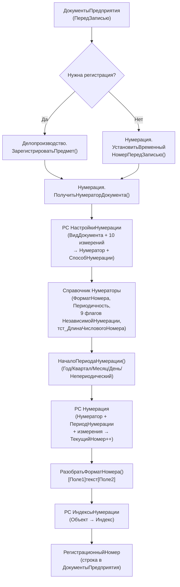

# Нумерация и регистрация документов в 1С:Документооборот КОРП 3.0

**Конфигурация**: ДокументооборотКОРП v3.0.14.31 (проект «Тест ДО3»)  
**Дата анализа**: 2026-06-05  
**Источник данных**: MCP-сервер rlm-tools-bsl v1.17.0, анализ исходного кода

---

## 1. Автоматическая нумерация при создании документа

Система поддерживает **два режима нумерации**, управляемых через реквизит `СпособыНумерации` (перечисление: `Автоматически` | `Вручную`) в РС `НастройкиНумерации`.

**При создании документа** (справочник `ДокументыПредприятия`, процедура `ПередЗаписью`, ObjectModule.bsl:746) выполняется ветка:

```
Если документ подлежит регистрации →
    Делопроизводство.ЗарегистрироватьПредмет(ЭтотОбъект, ...)
Иначе →
    Нумерация.УстановитьВременныйНомерПередЗаписью(ЭтотОбъект)
```

**Временный номер** назначается автоматически при первом сохранении, если у вида документа включён флаг `ИспользоватьВременныеНомера` (реквизит справочника `ВидыДокументов`). Временный номер формируется теми же механизмами нумерации (модуль `Нумерация`), но через нумератор с назначением `ВременныйНомер` (перечисление `НазначенияНумераторов`). Поля справочника: `ВременныйНомер` (строка) и `ЧисловойНомер` (число).

**Таким образом**: числовой счётчик и строковый номер формируются автоматически — вручную вводить их не нужно. При ручном режиме (`Вручную`) нумератор не назначается и пользователь вводит номер сам.

---

## 2. Регистрация документа — бизнес-процесс и механизм

**Регистрация** — это отдельный бизнес-процесс (`BusinessProcesses.Регистрация`, синоним «Бизнес-процесс: Регистрация»). Он запускается как часть жизненного цикла документа.

### Ключевая функция — `Делопроизводство.ЗарегистрироватьПредмет`
(CommonModules/Делопроизводство, строка 5599)

Алгоритм:
1. **Проверка прав**: `ДокументооборотПраваДоступа.ЕстьПравоРегистрации(Предмет)` — роль `РегистрацияДокументовПредприятия`
2. **Блокировка объекта** (защита от параллельной регистрации)
3. **Установка даты регистрации** (`ТекущаяДатаСеанса()` или из параметров)
4. **Автоформирование числового номера**: `Нумерация.СформироватьЧисловойНомерДокумента(...)` → поле `ЧисловойНомер`
5. **Автоформирование строкового номера**: `Нумерация.СформироватьСтроковыйНомерДокумента(...)` → поле `РегистрационныйНомер`
6. **Запись регистратора**: `Зарегистрировал = Сотрудники.ОсновнойСотрудник()`
7. **Сохранение объекта**

Эта функция вызывается из:
- `Catalogs/ДокументыПредприятия/Ext/ObjectModule.bsl` (основной путь)
- `CommonModules/ИнтеграцияЗадач` (через задачи)
- `Tasks/ЗадачаИсполнителя/Forms/тст_ЗадачиМне` (кастомная форма Тест)
- `WebServices/DMReg` (интеграция через веб-сервис)

### Бизнес-процесс Регистрация
Объект имеет 34 реквизита, в том числе:
- `Шаблон` → `CatalogRef.ШаблоныРегистрации` (определяет исполнителя, сроки, маршрут)
- `ПовторитьРегистрацию` (булево — для итеративной регистрации)
- `РезультатРегистрации` → перечисление `РезультатыРегистрации`: `Зарегистрировано` | `НеЗарегистрировано`
- `КоличествоИтераций`, `НомерИтерации` (поддержка повторных итераций)
- ТЧ `РезультатыРегистрации` — история итераций

Кроме того, в конфигурации есть кастомная подписка Тест `тст_НеобходимаРегистрация` (реквизит-флаг справочника `ВидыДокументов`) — она указывает, что документ данного вида требует обязательной регистрации при создании.

---

## 3. Где хранятся настройки нумерации

Система нумерации использует **три регистра сведений** и **один справочник**:

### РС `НастройкиНумерации` — главная таблица привязки
Измерения (ключ):
| Измерение | Тип |
|-----------|-----|
| ВидДокумента | CatalogRef.ВидыДокументов |
| ВопросДеятельности | CatalogRef.ВопросыДеятельности |
| ГрифДоступа | CatalogRef.ГрифыДоступа |
| Контрагент | CatalogRef.Контрагенты |
| Назначение | EnumRef.НазначенияНумераторов |
| Организация | CatalogRef.Организации |
| Подразделение | CatalogRef.СтруктураПредприятия |
| Проект | CatalogRef.Проекты |
| Тематика | CatalogRef.ТематикиДокументов |
| ТипДокумента | EnumRef.ТипыОбъектов |
| УзелКОД | CatalogRef.УзлыКОД |

Ресурсы: `Нумератор` (ссылка на справочник Нумераторы), `СпособНумерации` (Автоматически/Вручную)  
Атрибуты: `Комментарий`, `Нумеровать` (булево)

Функция чтения: `Нумерация.ПрочитатьНастройкиНумерацииВидаДокумента(ВидДокумента)` — SELECT из РС по ВидуДокумента.

### РС `Нумерация` — текущие счётчики
Содержит значение счётчика для каждой уникальной комбинации измерений нумератора. Измерения включают: Нумератор, ПериодНумерации, ГрифДоступа, Организация, СвязанныйДокумент, Подразделение, Проект, ВопросДеятельности, ВидДокумента, Тематика, УзелКОД. Ресурс: `ТекущийНомер` (Number).

### РС `ИндексыНумерации` — индексы объектов
Хранит строковые индексы (коды) для объектов: Сотрудники, Контрагенты, Проекты, Подразделения, ВидыДокументов, ТематикиДокументов, Пользователи, ГрифыДоступа, Организации, ВопросыДеятельности. Ресурс: `Индекс` (строка). Используется при подстановке полей `[ИндексОрг]`, `[ИндексПодр]` и т.д. в формат номера.

### РС `НумерацияШК` — нумерация штрих-кодов
Измерение: Нумератор; ресурс: ТекущийНомер. Отдельный счётчик для системы штрих-кодов документов.

### Справочник `Нумераторы`
Центральный объект настройки. Реквизиты (16):
- `ФорматНомера` (String) — шаблон строкового номера
- `Периодичность` → `EnumRef.ПериодичностьНумераторов`
- `Назначение` → `EnumRef.НазначенияНумераторов` (РегистрационныйНомер | ВременныйНомер)
- `ИспользоватьПропущенныеНомера` (Boolean) — возврат «дыр» в нумерации
- 9 флагов `НезависимаяНумерацияПо...` (по Организациям, Подразделению, Проекту, ВидуДокумента, Тематике, ГрифуДоступа, УзлуКОД, СвязанномуДокументу, ВопросуДеятельности)
- `ТипСвязи` — для независимой нумерации по связанному документу
- `Пример` (String) — пример сформированного номера
- **`тст_ДлинаЧисловогоНомера`** (Number) — **кастомная доработка Тест**: управляет шириной числового поля (ведущие нули)

---

## 4. Как формируется регистрационный номер

### Алгоритм формирования (модуль `Нумерация`)

**Шаг 1. Выбор нумератора** (`ПолучитьНумераторДокумента`)  
Запрос к РС `НастройкиНумерации` с весовым ранжированием: записи с заполненными измерениями (ВидДокумента, Организация, Подразделение, ВопросДеятельности, Контрагент, Проект, Тематика, ГрифДоступа) получают бо́льший вес. Выбирается запись с максимальным весом → берётся `Нумератор`.

**Шаг 2. Определение периода** (`НачалоПериодаНумерации`)  
По реквизиту `Периодичность` нумератора:
- `Год` → НачалоГода(ДатаРегистрации)
- `Квартал` → НачалоКвартала(ДатаРегистрации)
- `Месяц` → НачалоМесяца(ДатаРегистрации)
- `День` → НачалоДня(ДатаРегистрации)
- `Непериодический` → '00010101' (счётчик никогда не сбрасывается)

**Шаг 3. Получение числового номера** (`СформироватьЧисловойНомерДокумента`)  
Обращение к РС `Нумерация` по ключу (Нумератор + ПериодНумерации + измерения по флагам независимой нумерации). Атомарно увеличивает счётчик `ТекущийНомер` на 1, возвращает новое значение → записывается в `ЧисловойНомер` документа.

**Шаг 4. Разбор формата** (`РазобратьФорматНомера`)  
Шаблон `ФорматНомера` из справочника Нумераторы парсится по скобочной нотации `[имя_поля]`. Пример: `ДО-[ИндексОрг]-[Год4]-[Номер]` → структура для подстановки.

**Шаг 5. Подстановка значений** (`ПолучитьЗначенияПараметровНомера`)  
Каждое служебное поле заменяется значением:

| Поле в шаблоне | Источник значения |
|----------------|-------------------|
| `[Номер]` | ЧисловойНомер документа (с ведущими нулями через тст_ДлинаЧисловогоНомера) |
| `[День]` | День(ДатаРегистрации), формат ЧЦ=2 |
| `[Месяц]` | Месяц(ДатаРегистрации), формат ЧЦ=2 |
| `[Квартал]` | Квартал(ДатаРегистрации), 1-4 |
| `[Год4]` | Год(ДатаРегистрации), 4 знака |
| `[Год2]` | Год(ДатаРегистрации), 2 последних знака |
| `[ИндексОрг]` | РС ИндексыНумерации[Организация].Индекс |
| `[ИндексВидаДок]` | РС ИндексыНумерации[ВидДокумента].Индекс |
| `[ИндексПодр]` | РС ИндексыНумерации[Подразделение].Индекс |
| `[ИндексКонтр]` | РС ИндексыНумерации[Контрагент].Индекс |
| `[ИндексВопрДеят]` | РС ИндексыНумерации[ВопросДеятельности].Индекс |
| `[ИндексНомДел]` | РС ИндексыНумерации[НоменклатураДел].Индекс |
| `[НомерСвязДок]` | Номер связанного документа (по ТипуСвязи) |
| `[ИндексОтв]` | РС ИндексыНумерации[Ответственный].Индекс |
| `[ИндексПроекта]` | РС ИндексыНумерации[Проект].Индекс |
| `[ИндексГрифаДоступа]` | РС ИндексыНумерации[ГрифДоступа].Индекс |
| `[ИндексТематики]` | РС ИндексыНумерации[Тематика].Индекс |
| `[КодУзлаОбмена]` | Код узла КОД (для распределённых баз) |

**Итоговый регистрационный номер** записывается в реквизит `РегистрационныйНомер` справочника `ДокументыПредприятия`.

### Пример формата номера
Шаблон: `[ИндексОрг]-[Год2]/[Номер]` → результат: `Тест-26/00042`

### Освобождение номера (`ОсвободитьНомер`)
При смене или удалении регистрационного номера документа счётчик в РС `Нумерация` уменьшается (пропущенный номер возвращается в пул, если `ИспользоватьПропущенныеНомера = Истина`). Также обновляются PDF-файлы с регистрационным штампом.

---

## 5. Разные схемы нумерации для разных видов документов

**Да — система полностью поддерживает индивидуальные схемы нумерации** для разных видов документов, и не только.

### Уровни гибкости

**Уровень 1. Привязка нумератора к виду документа**  
В РС `НастройкиНумерации` для каждого сочетания `ВидДокумента` + `Назначение` задаётся свой `Нумератор`. Каждый нумератор имеет свой `ФорматНомера`, `Периодичность` и набор независимых измерений.

**Уровень 2. Привязка по организации/подразделению/проекту**  
Тот же вид документа может иметь разные нумераторы в зависимости от Организации, Подразделения, Проекта, ВопросаДеятельности, Тематики, ГрифаДоступа, УзлаКОД, Контрагента. Выбор — через весовой запрос с приоритизацией наиболее специфичной записи.

**Уровень 3. Независимые счётчики внутри нумератора**  
Нумератор можно настроить так, чтобы счётчик был независимым по каждому из 9 измерений (флаги `НезависимаяНумерацияПо...`). Например, `НезависимаяНумерацияПоОрганизациям = Истина` → у каждой организации свой счётчик `001, 002, ...`.

**Уровень 4. Периодичность сброса счётчика**  
Для каждого нумератора отдельно: сброс ежегодно, ежеквартально, ежемесячно, ежедневно или без сброса.

**Уровень 5. Временные vs регистрационные номера**  
Для одного вида документа можно настроить два нумератора: один с `Назначение = ВременныйНомер` (для неоформленных документов), другой с `Назначение = РегистрационныйНомер` (для зарегистрированных).

### Кастомные доработки Тест
- Реквизит `тст_НеобходимаРегистрация` у `ВидыДокументов` — принудительная регистрация при создании
- Реквизит `тст_ДлинаЧисловогоНомера` у `Нумераторов` — контроль ширины числового поля (ведущие нули)
- Поддержка типа `CatalogRef.тст_ВидыТиповыхПечатныхФорм` в измерениях РС Нумерация (нумерация типовых печатных форм)
- Кастомные поля `тст_Номер`, `тст_НомерДоговора`, `тст_Дата` у `ДокументыПредприятия` — альтернативные поля нумерации для договоров

---

## Схема системы нумерации (Mermaid)



---

## Итог

Система нумерации в ДО КОРП — многоуровневая, гибко настраиваемая. Для каждого вида документа (а также для различных комбинаций организации, подразделения, проекта и ещё 8 параметров) можно задать отдельный нумератор со своим форматом строки номера, периодичностью сброса счётчика и независимыми счётчиками по измерениям. Регистрационный номер формируется автоматически в момент регистрации через функцию `Делопроизводство.ЗарегистрироватьПредмет` с вызовом `Нумерация.СформироватьЧисловойНомерДокумента` и `Нумерация.СформироватьСтроковыйНомерДокумента`. Хранение настроек — в регистрах сведений `НастройкиНумерации` (привязка ВидДокумента→Нумератор), `Нумерация` (счётчики), `ИндексыНумерации` (коды-индексы объектов). Бизнес-процесс «Регистрация» управляет маршрутом регистрации с шаблоном исполнителей и итерациями. В проекте Тест добавлены кастомные расширения нумерации (тст_ДлинаЧисловогоНомера, тст_НеобходимаРегистрация).
