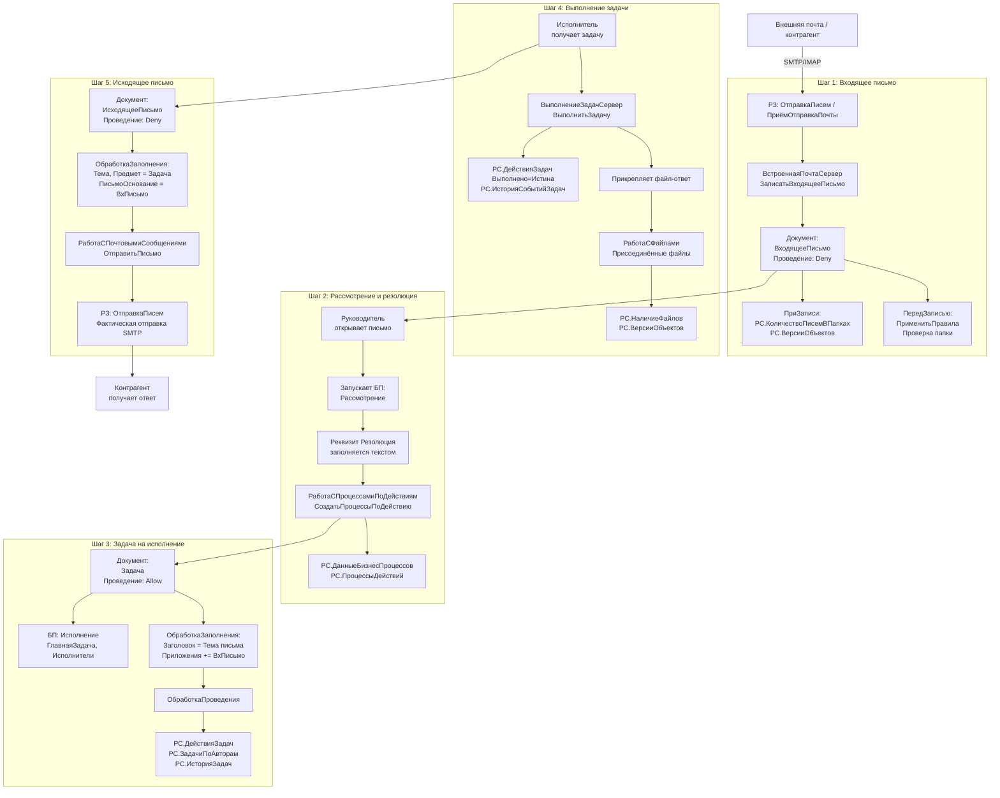

# Сквозной сценарий: ВходящееПисьмо → Резолюция → Задача → ИсходящееПисьмо
**Конфигурация:** 1С:Документооборот КОРП 3.0 (ДокументооборотКОРП v3.0.14.31)  
**MCP-сервер:** rlm-tools-bsl v1.17.0  
**Дата:** 2026-06-05  
**Источник:** анализ кодовой базы D:\Repos\Test\DO3\src\cf

> **Важно о достоверности:** Каждый блок явно помечен: [MCP] — факт из кода, [Логика] — вывод по структуре объектов/вызовам, [Допущение] — не проверено кодом.

---

## Общая схема сценария

```
[Внешняя почта] 
      ↓ РЗ: ОтправкаПисем / ПриёмОтправкаПочты
      ↓ ВстроеннаяПочтаСервер.ЗаписатьВходящееПисьмо()
      
[1] Документ: ВходящееПисьмо (создан/сохранён)
      ↓ ПередЗаписью: применяются правила маршрутизации
      ↓ ПриЗаписи: обновляется РС.КоличествоПисемВПапках
      ↓ OnWrite-подписки: версионирование, права доступа, рабочие группы
      
[2] Руководитель открывает письмо → запускает БП: Рассмотрение
      Реквизит "Резолюция" (строка) заполняется руководителем
      РС.ДанныеБизнесПроцессов обновляется (Состояние, ОсновнойПредмет)
      ↓ РаботаСПроцессамиПоДействиями.СоздатьПроцессыПоДействию()
      
[3] Создаётся Задача (на основании ВходящегоПисьмо)
      ОбработкаЗаполнения: Заголовок=Тема письма, ТЧ.Приложения ← ВходящееПисьмо
      Документ Задача проводится (Allow) → ОбработкаПроведения
      РС.ДействияЗадач, РС.ЗадачиПоАвторам обновляются
      
[4] Исполнитель выполняет задачу + прикладывает файл
      ВыполнениеЗадачСервер.ВыполнитьЗадачу(Задача, ПараметрыВыполнения)
      РС.НаличиеФайлов, РС.ИсторияСобытийЗадач обновляются
      
[5] Создаётся ИсходящееПисьмо (ввод на основании или вручную)
      ОбработкаЗаполнения: Тема←Наименование задачи, Предмет←ЗадачаИсполнителя
      РЗ ОтправкаПисем отправляет письмо наружу
```

---

## ШАГ 1: Поступление ВходящегоПисьма

### Создаваемый объект
**[MCP]** Документ `ВходящееПисьмо` — непроводимый (Posting=Deny).

Ключевые реквизиты (из `parse_object_xml`):
| Реквизит | Тип | Назначение |
|----------|-----|-----------|
| УчетнаяЗапись | CatalogRef.УчетныеЗаписиЭлектроннойПочты | Какой ящик принял письмо |
| ОтправительАдресат | CatalogRef.АдресатыПочтовыхСообщений | Контрагент-отправитель |
| Тема | xs:string | Тема письма |
| ДатаПолучения | xs:dateTime | Дата получения |
| Папка | CatalogRef.ПапкиПисем | Папка (обязательна — проверяется в ПередЗаписью) |
| Предмет | составной тип: Проекты, ЗадачаИсполнителя, Файлы, ДокументыПредприятия, Мероприятия и др. | Предмет письма |
| ВидМаршрутизации | EnumRef.ВидыМаршрутизацииПисем | Внешняя/внутренняя |
| ТекстПисьмаHTMLХранилище | v8:ValueStorage | Тело письма (HTML) |

ТЧ: `ПолучателиПисьма`, `ПолучателиКопий`, `ПолучателиОтвета`, `АдресаУведомленияОПрочтении`

### Как создаётся (программно)
**[MCP]** Функция `ВстроеннаяПочтаСервер.ЗаписатьВходящееПисьмо(Сообщение, УчетнаяЗапись)`:
```bsl
НачатьТранзакцию();
ПисьмоОбъект = Документы.ВходящееПисьмо.СоздатьДокумент();
ПисьмоОбъект.УчетнаяЗапись = УчетнаяЗапись;
ПисьмоОбъект.ВидМаршрутизации = Перечисления.ВидыМаршрутизацииПисем.Внешняя;
ЗаполнитьВходящееПисьмоИзСтруктурыПочтовогоСообщения(ПисьмоОбъект, Сообщение, УчетнаяЗапись);
```
Перед записью проверяется дубликат по `ИдентификаторСообщения` → `РС.ИдентификаторыПолученныхПисем`.

### Обработчики событий при записи
**[MCP]** Из `find_event_subscriptions("ВходящееПисьмо")` — ключевые:

**BeforeWrite:**
- `ВстроеннаяПочтаСервер.ПрименитьПравила(ЭтотОбъект)` — применение правил маршрутизации (в ПередЗаписью ObjectModule, строка 40)
- `ДокументооборотПраваДоступа` — проверка прав
- `ВерсионированиеОбъектовСобытия.ЗаписатьВерсиюОбъекта` — создание версии
- `РегламентныеЗаданияСлужебный.ВключитьРегламентноеЗаданиеПриИзмененииФункциональнойОпции`

**OnWrite:**
- `РаботаСБизнесПроцессамиВызовСервера.БизнесПроцессПриЗаписиПриЗаписи`
- `БизнесПроцессыИЗадачиСобытия.ЗаписатьВСписокБизнесПроцессов`
- `БизнесПроцессыИЗадачиСобытия.ЗадачиСПодзадачамиПриЗаписиБизнесПроцессаПриЗаписи`
- `МЭДО.СинхронизироватьДанныеДокументаМЭДОПриЗаписи` — МЭДО-синхронизация
- `РаботаСФайлами.ВыполнитьДействияПриЗаписиПрисоединенногоФайла`

**[MCP]** В `ПриЗаписи` ObjectModule (строки 61-103):
```bsl
// Обновление счётчика писем в папке
РегистрыСведений.КоличествоПисемВПапках.ОчиститьЗаписиПоПапке(Папка);

// Расширение рабочей группы предмета — запрос к РС.СведенияОбАдресатах
// добавляет получателей письма в рабочую группу предмета
```

### Регистры сведений (обновляются при записи)
**[MCP]** Из кода ObjectModule и структур регистров:
| Регистр | Что пишется |
|---------|------------|
| РС.КоличествоПисемВПапках | Счётчик [Папка+Пользователь] → [Всего, Прочтено] |
| РС.ИдентификаторыПолученныхПисем | Дедубликация входящих по MessageId |
| РС.ВерсииОбъектов | Версия документа |
| РС.ДатыЗакрытияКарточекПисем | При закрытии письма |
| РС.HTMLПредставленияСодержанияПисем | HTML-кэш тела письма |
| РС.КраткиеТекстыПисем | Краткий текст для списков |
| РС.ВложенныеПисьма | Связи вложенных писем |

### Регламентные задания (приём почты)
**[MCP]** Из `find_scheduled_jobs()`:
| Задание | Метод | Статус |
|---------|-------|--------|
| ОтправкаПисем | ВстроеннаяПочтаСервер.ОтправкаПисем | **Включено** |
| ОтправкаПисемПоВнутреннейМаршрутизации | ВстроеннаяПочтаСервер.ОтправкаПисемПоВнутреннейМаршрутизации | **Включено** |
| ПриёмОтправкаПочты1..10 | ВстроеннаяПочтаСервер.ПриёмОтправкаПочты1..10 | Выключено |

---

## ШАГ 2: Рассмотрение письма руководителем и вынесение Резолюции

### Используемый бизнес-процесс
**[MCP]** БП `Рассмотрение` — один из 10 типов бизнес-процессов конфигурации:
Исполнение, КомплексныйПроцесс, Ознакомление, Подписание, **Рассмотрение**, Согласование, Утверждение, Регистрация, Приглашение, РешениеВопросовВыполненияЗадач.

**[MCP]** Ключевые реквизиты БП Рассмотрение (из `parse_object_xml("BusinessProcesses/Рассмотрение")`):
| Реквизит | Тип | Назначение |
|----------|-----|-----------|
| **Резолюция** | xs:string | Текст резолюции руководителя |
| ВариантОбработкиРезолюции | EnumRef.ВариантыОбработкиРезолюции | Автоматически/вручную создать задачи |
| ВариантРассмотрения | EnumRef.ВариантыРассмотрения | Только рассмотрение / с исполнением |
| Исполнитель | CatalogRef.Сотрудники, ПолныеРоли, Пользователи | Кому направляется на рассмотрение |
| ОбрабатывающийРезолюцию | CatalogRef.Сотрудники, ПолныеРоли | Кто обрабатывает резолюцию |
| ИдентификаторОбрабатывающегоРезолюцию | v8:UUID | Идентификатор задачи по обработке резолюции |
| Шаблон | CatalogRef.ШаблоныРассмотрения | Шаблон процесса |
| ШаблонИсполнения | CatalogRef.ШаблоныИсполнения | Шаблон дочернего исполнения |
| ГлавнаяЗадача | TaskRef.ЗадачаИсполнителя | Главная задача процесса |
| ПоставитьДокументНаКонтроль | xs:boolean | Поставить на контроль |

ТЧ: `ИсполнителиИсполнения`, `ИсполнителиОзнакомления`, `Предметы`, `ПредметыЗадач`

### Создание и запуск БП Рассмотрение
**[MCP]** В `РаботаСПроцессамиПоДействиями.СоздатьПроцессыПоДействию()` (строки 958–1011):
```bsl
// Если действие типа ДействияИсполнения:
ПроцессПоДействиям = СоздатьПроцессыРассмотренияПоДействию(Действие, ПроцессОбработки);
НовыйПроцесс = СоздатьПроцессИсполненияПоДействию(Действие, ПроцессОбработки);

// После создания:
ПроцессПоДействию.Записать();
РегистрыСведений.ПроцессыДействий.Добавить(ПроцессПоДействию.Ссылка, Действие.Ссылка);
УстановитьЗадержкуНачалаВыполнения(Действие, ПроцессПоДействию);
```

### Задача-исполнитель при рассмотрении
**[MCP]** `Tasks.ЗадачаИсполнителя` (19 реквизитов) — стандартный объект 1С:
| Реквизит | Тип |
|----------|-----|
| ТекущийИсполнитель | CatalogRef.Сотрудники, ПолныеРоли, Пользователи |
| ФактическийИсполнитель | CatalogRef.ФактическиеИсполнители |
| РезультатВыполнения | xs:string |
| СостояниеБизнесПроцесса | EnumRef.СостоянияБизнесПроцессов |
| СрокИсполнения | xs:dateTime |
| ПринятаКИсполнению | xs:boolean |

### Работа с резолюцией
**[MCP]** Модуль `РаботаСРезолюциями` (7 экспортных функций):
- `ПолучитьРезолюции(Документ, ТолькоАктивные, ПолучитьДанныеЭП, Источник, ИдентификаторУчастника)` — получить все резолюции по документу
- `ПолучитьРезолюциюПоДате(Документ, ДатаРезолюции)` — резолюция на конкретную дату
- `ЭтоАвторРезолюции(Резолюция, Пользователь)` — проверка авторства
- `ПроверитьДоступНаПодписание(Резолюция)` — подпись резолюции ЭП
- `УстановитьПометкуУдаленияРезолюцийПоДокументу(Документ, Пометка, ИдентификаторУчастника)`

**[MCP]** Форма `БизнесПроцессы/Рассмотрение/Forms/ФормаИзменениеПараметров` содержит обработчик `AutoComplete` → `НаименованиеОбработатьРезолюциюАвтоПодбор` — автоподбор при вводе резолюции.

### Регистры (обновляются при записи БП)
**[MCP]** Из подписок OnWrite (`БизнесПроцессПриЗаписи`, `ЗаписатьВСписокБизнесПроцессов`):
| Регистр | Что пишется |
|---------|------------|
| РС.ДанныеБизнесПроцессов | [БизнесПроцесс, Завершен] → [Автор, ВедущаяЗадача, ОсновнойПредмет, Состояние, СрокИсполнения, Стартован] |
| РС.ДочерниеБизнесПроцессы | Связи вложенных/дочерних процессов |
| РС.ПроцессыДействий | [БП.Ссылка, Действие.Ссылка] — новый процесс |
| РС.НастройкаПовторенияБизнесПроцессов | Если настроено повторение |
| РС.ДоступностьШаблоновПроцессов | [Логика] — при использовании шаблона |

---

## ШАГ 3: Создание Задачи на исполнение по резолюции

### Создаваемый объект
**[MCP]** Документ `Задача` — **проводимый** (Posting=Allow), имеет 30 реквизитов и 2 ТЧ.

Ключевые реквизиты (из `parse_object_xml("Documents/Задача")`):
| Реквизит | Тип | Назначение |
|----------|-----|-----------|
| Заголовок | xs:string | Название задачи |
| ВышестоящаяЗадача | DocumentRef.Задача | Родительская задача (иерархия) |
| ВышестоящееДействие | DocumentRef.ДействиеЗадачи | Действие, породившее задачу |
| Источник | составной тип | Документ-источник (письмо, процесс) |
| СостояниеЗадачи | CatalogRef.СостоянияЗадач | Текущее состояние |
| РезультатЗадачи | CatalogRef.РезультатыЗадач | Результат выполнения |
| Ответственный | составной тип | Исполнитель |
| Срок | xs:dateTime | Срок исполнения |
| Приоритет | CatalogRef.ПриоритетыЗадач | Приоритет |
| ВидЗадачи | CatalogRef.ВидыЗадач | Вид задачи |

ТЧ: `Приложения` (вложенные документы), `Участники`

### Логика создания задачи из письма
**[MCP]** `ОбработкаЗаполнения` в `Documents/Задача/Ext/ObjectModule.bsl` (строки 1570–1585):
```bsl
Если ТипЗнч(Основание) = Тип("ДокументСсылка.ВходящееПисьмо")
    Или ТипЗнч(Основание) = Тип("ДокументСсылка.ИсходящееПисьмо") Тогда

    РеквизитыПисьма = ОбщегоНазначения.ЗначенияРеквизитовОбъекта(Основание, "Тема, Проект");
    Заголовок = РеквизитыПисьма.Тема;       // Тема письма → Заголовок задачи
    Проект = РеквизитыПисьма.Проект;         // Проект письма → Проект задачи
    НовоеФорматированноеОписание = ИнтеграцияЗадач.ОписаниеФорматированное(Основание);
    УстановитьОписаниеФорматированное(НовоеФорматированноеОписание);

    СтрокаПриложения = Приложения.Добавить();
    СтрокаПриложения.Приложение = Основание; // ВходящееПисьмо добавляется в ТЧ Приложения
```

**[MCP]** При создании из `Задача` (подзадача):
```bsl
ВышестоящаяЗадача = Основание;  // ссылка на родительскую задачу
// Копируются: Заголовок, Проект, Срок, Приоритет, Описание
```

### Связь с БП Исполнение
**[MCP]** БП `Исполнение` (создаётся при обработке резолюции):
| Реквизит | Значение |
|----------|---------|
| ГлавнаяЗадача | TaskRef.ЗадачаИсполнителя |
| Шаблон | CatalogRef.ШаблоныИсполнения |
| Контролер | Сотрудник/Пользователь/Роль |
| Проверяющий | Сотрудник/Пользователь/Роль |
| ВариантИсполнения | EnumRef.ВариантыМаршрутизацииЗадач |
| ТЧ Исполнители | Список исполнителей |
| ТЧ Предметы | Предметы задания |
| ТЧ РезультатыИсполнения | Для хранения результатов |

### Проведение Задачи
**[MCP]** Документ Задача **проводимый** (Allow), имеет `ОбработкаПроведения` (строка 2698 ObjectModule). При проведении обновляются регистры задач.

**[MCP]** Ключевые процедуры ObjectModule Задача (экспортные):
- `ОтметитьВыполнена`, `ОтметитьВРаботе`, `ОтметитьОжидаетПроверки` — переходы состояний
- `НаправитьНаИсполнение` — направить задачу исполнителю
- `ОтправитьНаПроверку`, `ВернутьНаДоработку` — цикл проверки
- `УстановитьСостояние` — установка произвольного состояния
- `УстановитьУчастников` — управление участниками

### Регистры (обновляются при записи Задача)
**[MCP]** Из структур регистров и подписок:
| Регистр | Что пишется |
|---------|------------|
| РС.ДействияЗадач | [Исполнитель, Дата, ДействиеЗадачи] → 40 ресурсов: Выполнено, ВРаботе, Просрочено, Срок, Заголовок, Задача, ОжидаетПроверки... |
| РС.ЗадачиПоАвторам | [Автор, Дата, Задача] → ВидЗадачи, ВРаботе, Выполнена, ДатаВыполнения |
| РС.ЗадачиСПодзадачами | [Задача] — плоский список всех задач |
| РС.ИсторияЗадач | [Задача, Событие, Дата, ДействиеЗадачи] → [Контекст] — история событий |
| РС.ИсторияСобытийЗадач | [Задача, ДатаСобытия, Сотрудник, Событие] → Комментарий |
| РС.ДанныеБизнесПроцессов | ОсновнойПредмет=ВходящееПисьмо, Состояние, ВедущаяЗадача |
| РС.ВсеИсполнителиДействийЗадач | [ДействиеЗадачи, Исполнитель, Основание] |

### Регламентные задания (контроль задач)
**[MCP]**:
| Задание | Метод | Статус |
|---------|-------|--------|
| ОбслуживаниеИтоговЗадач | РаботаСЗадачами.ОбслуживаниеИтоговЗадач | **Включено** |
| ПометкаЗадачПросроченными | РаботаСЗадачами.ПометкаЗадачПросроченными | **Включено** |
| КонтрольСрокаЗадач | РаботаСУведомлениями.КонтрольСрокаЗадача | Выключено |
| МониторингПроцессов | МониторингПроцессов.МониторингПроцессов | Выключено |
| ПовторениеБизнесПроцессов | ПовторениеБизнесПроцессов.ПовторениеБизнесПроцессовПоРасписанию | **Включено** |

---

## ШАГ 4: Исполнитель выполняет задачу и прикладывает файл

### Выполнение задачи (код)
**[MCP]** `ВыполнениеЗадачСервер.ВыполнитьЗадачу(Задача, ПараметрыВыполнения, ОтключитьОбновлениеЗадач)` (строки 315–365):

```bsl
// 1. Проверка прав
ПраваПользователяПоОбъекту = ДокументооборотПраваДоступа.ПраваПользователяПоОбъекту(Задача);
Если Не ПраваПользователяПоОбъекту.Изменение Тогда
    ВызватьИсключение "Недостаточно прав для выполнения задачи";

// 2. Параметры выполнения (из задачи, если не переданы):
// ДатаИсполнения, ИсполнительЗадачи, РезультатВыполнения, ПользовательИсполнитель

// 3. Если исполнитель — Роль, берётся основной сотрудник:
Если ТипЗнч(ИсполнительЗадачи) = Тип("СправочникСсылка.ПолныеРоли") Тогда
    ПараметрыВыполнения.ИсполнительЗадачи = Сотрудники.ОсновнойСотрудник();

// 4. Обработка через очередь заданий (если настроено):
Если ОбработкаОчередиЗаданийСервер.ОбработатьВыполнениеЗадачи(Задача, ПараметрыВыполнения) Тогда
    Возврат;

// 5. Вызов событий:
РаботаСПроцессамиПоДействиямСобытия.ПриВыполненииЗадачиСПараметрами(Задача, ПараметрыВыполнения);

// 6. Немедленное выполнение:
ВыполнитьЗадачуСПараметрамиНемедленно(Задача, ПараметрыВыполнения, ОтключитьОбновлениеЗадач);
```

### Прикрепление файла-ответа
**[MCP]** Из подписок BeforeWrite/OnWrite для Задача:
- `РаботаСФайлами.ВыполнитьДействияПередЗаписьюПрисоединенногоФайла`
- `РаботаСФайлами.ВыполнитьДействияПриЗаписиПрисоединенногоФайла`
- `ПрисоединенныеФайлы.УстановитьПометкуУдаленияПрисоединенныхФайлов`

**[MCP]** Из структуры `РС.НаличиеФайлов`:
- Измерение: `ОбъектСФайлами` (ссылка на Задачу)
- Ресурс: `ЕстьФайлы` (булево)
- Реквизит: `ИдентификаторОбъекта`

**[MCP]** `РС.ВерсииОбъектов` — версионирование файлов:
- [Объект, НомерВерсии] → АвторВерсии, ДатаВерсии, Комментарий, ТипВерсии, РазмерДанных

### Смена состояния задачи при выполнении
**[MCP]** Из ObjectModule Задача — процедуры перехода состояний:
- `ОтметитьВыполнена()` → вызывается при выполнении
- `ОтметитьОжидаетПроверки()` → если настроена проверка
- `ОбновитьСостоянияПриИзмененииУчастников()`

**[MCP]** Подписка `OnExecute ЗадачаКомплексногоПроцессаПриВыполнении` → `РаботаСКомплекснымиБизнесПроцессамиСервер` — срабатывает при выполнении задачи в контексте комплексного процесса.

### Регистры (обновляются при выполнении)
**[MCP]**:
| Регистр | Что пишется |
|---------|------------|
| РС.ДействияЗадач | Флаг Выполнено=Истина, ДатаВыполнения |
| РС.ИсторияЗадач | Событие "Выполнена", ДатаСобытия, Автор |
| РС.ИсторияСобытийЗадач | Событие выполнения + Комментарий (результат) |
| РС.НаличиеФайлов | ЕстьФайлы=Истина для Задачи (если прикреплён файл) |
| РС.ВерсииОбъектов | Новая версия прикреплённого файла |

---

## ШАГ 5: Формирование ИсходящегоПисьма с ответом

### Создаваемый объект
**[MCP]** Документ `ИсходящееПисьмо` — непроводимый (Posting=Deny), 27 реквизитов, 4 ТЧ.

Ключевые реквизиты:
| Реквизит | Тип | Назначение |
|----------|-----|-----------|
| **ПисьмоОснование** | DocumentRef.ВходящееПисьмо \| DocumentRef.ИсходящееПисьмо | Ссылка на письмо-основание |
| ТипОтвета | EnumRef.ТипыОтвета | ОтветНаПисьмо / ПересылкаПисьма |
| Автор | CatalogRef.Сотрудники, CatalogRef.Пользователи | Автор письма |
| ОтправительКонтакт | составной: Сотрудники, ФизическиеЛица, Контрагенты, Пользователи | Отправитель |
| Тема | xs:string | Тема (с префиксом Re: / Fwd:) |
| УчетнаяЗапись | CatalogRef.УчетныеЗаписиЭлектроннойПочты | Почтовый ящик для отправки |
| Предмет | составной тип | ЗадачаИсполнителя или другой предмет |

ТЧ: `ПолучателиПисьма`, `ПолучателиКопий`, `ПолучателиСкрытыхКопий`, `ПолучателиОтвета`

### Ввод на основании
**[MCP]** `find_based_on_documents("ВходящееПисьмо")`:
- Из ВходящегоПисьма можно создать: **Задача** (via ObjectModule back_scan)

**[MCP]** `ОбработкаЗаполнения` ObjectModule ИсходящееПисьмо вызывает `СформироватьСтруктуруРеквизитовПисьма(ДанныеЗаполнения)`.

### Логика создания ответного письма из задачи
**[MCP]** `ЗаполнитьСтруктуруРеквизитовПоЗадачеИсполнителя()` (строки 1087–1096):
```bsl
РеквизитыЗадачиИсполнителя = ОбщегоНазначения.ЗначенияРеквизитовОбъекта(
    ЗадачаИсполнителя, "Наименование, Проект");

СтруктураРеквизитов.Вставить("Тема", РеквизитыЗадачиИсполнителя.Наименование);
СтруктураРеквизитов.Вставить("Проект", РеквизитыЗадачиИсполнителя.Проект);
СтруктураРеквизитов.Вставить("Предмет", ЗадачаИсполнителя);  // Предмет = Задача
```

### Логика создания ответа на входящее письмо
**[MCP]** `ЗаполнитьСтруктуруРеквизитовПоПисьму()` (строки 337–390):
```bsl
// Команда "Ответить":
ПрефиксТемыПисьма = ВстроеннаяПочтаСервер.ПолучитьПрефиксДляОтветныхПисем(); // "Re: "
СтруктураРеквизитов.Вставить("ТипОтвета", Перечисления.ТипыОтвета.ОтветНаПисьмо);
// Отправитель входящего становится получателем исходящего

// Команда "ОтветитьВсем":
ПеренестиВсехПолучателейВПолучатели = Истина;

// Команда "Переслать":
ПрефиксТемыПисьма = ВстроеннаяПочтаСервер.ПолучитьПрефиксДляПересылаемыхПисем(); // "Fwd: "
СтруктураРеквизитов.Вставить("ТипОтвета", Перечисления.ТипыОтвета.ПересылкаПисьма);
```

### Связь исходящего с входящим
**[MCP]** Реквизит `ПисьмоОснование` (DocumentRef.ВходящееПисьмо) — прямая ссылка в ИсходящемПисьме на ВходящееПисьмо.

**[MCP]** `ВстроеннаяПочтаСервер.НайтиИсходящиеПисьмаПоИдентификаторуОснования()` — поиск всех ответов на входящее письмо.

### Отправка исходящего письма
**[MCP]** `РаботаСПочтовымиСообщениями.ОтправитьПисьмо(УчетнаяЗапись, Письмо)` (export):
```bsl
Возврат РаботаСПочтовымиСообщениямиСлужебный.ОтправитьПисьмо(УчетнаяЗапись, Письмо);
```

**[MCP]** Регламентное задание `ОтправкаПисем` (активно) — отправляет все подготовленные к отправке исходящие письма.

### Обработчики событий ИсходящегоПисьма
**[MCP]** Из `find_event_subscriptions("ИсходящееПисьмо")`:
- Те же BeforeWrite/OnWrite-подписки, что у ВходящегоПисьма
- Дополнительно: `OnWrite ПредметКонтроляПриЗаписи → КонтрольСобытия` — постановка предмета на контроль

---

## Сводная таблица: регистры сведений сквозного сценария

**[MCP]** Все перечисленные регистры подтверждены из кода или XML-структуры.

| Регистр | Шаг | Что отражает |
|---------|-----|-------------|
| РС.ИдентификаторыПолученныхПисем | 1 | Дедубликация входящих |
| РС.КоличествоПисемВПапках | 1 | Счётчик писем по папкам |
| РС.HTMLПредставленияСодержанияПисем | 1 | HTML-кэш тела письма |
| РС.КраткиеТекстыПисем | 1 | Краткий текст для списков |
| РС.ВложенныеПисьма | 1 | Структура вложенных писем |
| РС.ДатыЗакрытияКарточекПисем | 1, 5 | Дата закрытия карточки письма |
| РС.ВерсииОбъектов | 1–5 | Версии документов (все шаги) |
| РС.ДанныеБизнесПроцессов | 2, 3 | Состояние БП, предмет, срок |
| РС.ПроцессыДействий | 2 | Связь БП ↔ Действие |
| РС.ДочерниеБизнесПроцессы | 2 | Вложенность БП |
| РС.ДействияЗадач | 3, 4 | Состояние задачи (40 ресурсов) |
| РС.ЗадачиПоАвторам | 3, 4 | Задачи по авторам |
| РС.ЗадачиСПодзадачами | 3 | Иерархия задач |
| РС.ВсеИсполнителиДействийЗадач | 3, 4 | Все исполнители действий |
| РС.ИсторияЗадач | 3, 4 | История событий задачи |
| РС.ИсторияСобытийЗадач | 3, 4 | Детальная история событий |
| РС.ИсторияСостоянийДокументов | 1–5 | История состояний документов |
| РС.НаличиеФайлов | 4 | Есть ли файлы у объекта |

---

## Сводная таблица: ключевые модули и процедуры

**[MCP]** Все модули и процедуры подтверждены из кодовой базы.

| Шаг | Модуль | Ключевые процедуры |
|-----|--------|--------------------|
| 1 | `ВстроеннаяПочтаСервер` | `ЗаписатьВходящееПисьмо`, `ПрименитьПравила`, `ЗаполнитьРеквизитыПисьмаИзОснования` |
| 1 | `Documents/ВходящееПисьмо/ObjectModule` | `ПередЗаписью`, `ПриЗаписи`, `ПолучитьСодержаниеПисьма` |
| 1 | `Documents/ВходящееПисьмо/ManagerModule` | `ПолучитьПоляДоступа`, `ПолучитьHTMLПредставлениеСодержанияПисьма` |
| 2 | `РаботаСПроцессамиПоДействиям` | `СоздатьПроцессыПоДействию`, `СоздатьПроцессРассмотренияПоДействию`, `ЗапуститьПроцессПоДействию` |
| 2 | `РаботаСРезолюциями` | `ПолучитьРезолюции`, `ПолучитьРезолюциюПоДате`, `ЭтоАвторРезолюции` |
| 2 | `РаботаСБизнесПроцессамиВызовСервера` | `БизнесПроцессПриЗаписи`, `ПередЗаписьюБизнесПроцесса`, `ПолучитьВсехУчастниковПроцесса` |
| 3 | `Documents/Задача/ObjectModule` | `ОбработкаЗаполнения`, `ОбработкаПроведения`, `НаправитьНаИсполнение`, `УстановитьСостояние` |
| 3 | `БизнесПроцессыИЗадачиСобытия` | `ЗадачаПриЗаписи`, `ЗаписатьВСписокБизнесПроцессов` |
| 4 | `ВыполнениеЗадачСервер` | `ВыполнитьЗадачу`, `ВыполнитьЗадачуСПараметрамиНемедленно`, `ВыполнитьЗадачуПоПочте` |
| 4 | `РаботаСФайлами` | `ВыполнитьДействияПередЗаписьюПрисоединенногоФайла`, `ВыполнитьДействияПриЗаписиПрисоединенногоФайла` |
| 5 | `Documents/ИсходящееПисьмо/ObjectModule` | `ОбработкаЗаполнения`, `ЗаполнитьСтруктуруРеквизитовПоПисьму`, `ЗаполнитьСтруктуруРеквизитовПоЗадачеИсполнителя` |
| 5 | `РаботаСПочтовымиСообщениями` | `ОтправитьПисьмо` |
| 5 | `ВстроеннаяПочтаСервер` | `ОтправкаПисем`, `НайтиИсходящиеПисьмаПоИдентификаторуОснования` |

---

## Диаграмма сценария (Mermaid)



---

## Итоговая оценка достоверности

| Аспект | Источник | Оценка |
|--------|----------|--------|
| Структуры документов (реквизиты, ТЧ) | parse_object_xml | Полная достоверность |
| Обработчики событий (подписки) | find_event_subscriptions | Полная достоверность |
| Структуры регистров (измерения, ресурсы) | parse_object_xml | Полная достоверность |
| Код ключевых процедур | read_procedure | Полная достоверность |
| Логика ввода на основании | find_based_on + код ОбработкиЗаполнения | Полная достоверность |
| Регламентные задания (активность) | find_scheduled_jobs | Полная достоверность |
| Последовательность шагов сценария | Логика по структурам и вызовам | Высокая достоверность |
| Детали UI-взаимодействия (кнопки формы) | [Допущение] Не анализировались | Не проверено |
