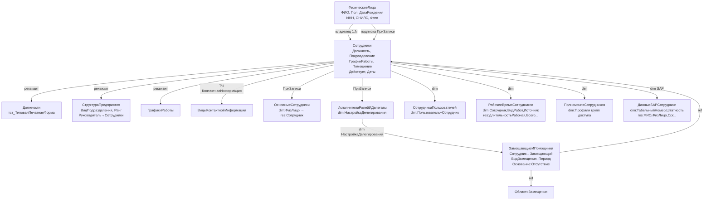

# Бизнес-отчёт: Структура справочника Сотрудники
**Конфигурация:** 1С:Документооборот КОРП 3.0 (ДокументооборотКОРП v3.0.14.31)
**Тест:** TEST-03
**MCP-сервер:** rlm-tools-bsl v1.18.0
**Дата:** 2026-06-07
**Источник данных:** исключительно MCP-инструменты rlm-tools-bsl (проект «Тест ДО3»)

---

## 1. Реквизиты справочника Сотрудники

Справочник `Catalogs.Сотрудники` является **подчинённым** (владелец — `Catalogs.ФизическиеЛица`).
Наименование формируется автоматически как `Строка(Владелец)` — т.е. копируется из наименования ФизЛица.

### 1.1 Стандартные реквизиты (платформа 1С)
| Реквизит | Тип | Описание |
|---|---|---|
| Ссылка | CatalogRef.Сотрудники | Ключ объекта |
| Наименование | String | ФИО (= Строка(Владелец)) |
| Владелец | CatalogRef.ФизическиеЛица | Физическое лицо (связь 1:N) |
| ПометкаУдаления | Boolean | — |

### 1.2 Пользовательские реквизиты (9 штук)
| Реквизит | Синоним | Тип |
|---|---|---|
| ГрафикРаботы | График работы | `CatalogRef.ГрафикиРаботы` |
| ДатаНачалаДействия | Дата начала действия | `DateTime` |
| ДатаОкончанияДействия | Дата окончания действия | `DateTime` |
| Действует | Действует | `Boolean` |
| Должность | Должность | `CatalogRef.Должности` |
| Подразделение | Подразделение | `CatalogRef.СтруктураПредприятия` |
| Помещение | Помещение | `CatalogRef.ТерриторииИПомещения` |
| ПредставлениеВДокументах | Представление в документах | `String` |
| ПредставлениеВПереписке | Представление в переписке | `String` |

*Источник: get_object_full_structure('Сотрудники'), parse_object_xml('Catalogs/Сотрудники')*

---

## 2. Табличные части

### 2.1 ДополнительныеРеквизиты (3 колонки)
Стандартная ТЧ подсистемы «Дополнительные реквизиты и сведения» (БСП):
| Колонка | Тип |
|---|---|
| Свойство | `ChartOfCharacteristicTypesRef.ДополнительныеРеквизитыИСведения` |
| Значение | (составной, зависит от вида) |
| ТекстоваяСтрока | `String` |

### 2.2 КонтактнаяИнформация (13 колонок)
Стандартная ТЧ подсистемы «Контактная информация» (БСП):
| Колонка | Тип |
|---|---|
| Тип | `EnumRef.ТипыКонтактнойИнформации` |
| Вид | `CatalogRef.ВидыКонтактнойИнформации` |
| Представление | `String` |
| ЗначенияПолей | `String` |
| Страна | `String` |
| Регион | `String` |
| Город | `String` |
| АдресЭП | `String` |
| ДоменноеИмяСервера | `String` |
| НомерТелефона | `String` |
| НомерТелефонаБезКодов | `String` |
| ВидДляСписка | `CatalogRef.ВидыКонтактнойИнформации` |
| Значение | `String` |

*Источник: get_object_full_structure('Сотрудники') — tabular_sections*

---

## 3. Формы справочника Сотрудники

| Форма | Назначение |
|---|---|
| ФормаЭлемента | Основная карточка сотрудника (DefaultObjectForm) |
| ФормаВыбора | Диалог выбора сотрудника |
| СотрудникиОбоМне | Мои данные как сотрудника |
| ФормаСотрудниковДолжности | Список сотрудников по должности |
| ФормаСотрудниковПодразделения | Список сотрудников по подразделению |

---

## 4. Связи с другими справочниками

### 4.1 Справочник ФизическиеЛица (Catalogs.ФизическиеЛица)
**Тип связи: владелец (1:N)** — одно физическое лицо может иметь несколько записей Сотрудников.

Механизм работы (из кода):
- `Catalogs/Сотрудники/Ext/ObjectModule.bsl`, `ЗаполнитьНаименование`, строка 43:
  ```bsl
  НовоеНаименование = Строка(Владелец); // Владелец = ФизическоеЛицо
  ```
- При записи ФизЛица автоматически обновляются наименования всех подчинённых сотрудников.
  `CommonModules/СотрудникиСобытия/Ext/Module.bsl`, `ПриЗаписиФизическогоЛица`, строки 72–113:
  ```bsl
  ВЫБРАТЬ Сотрудники.Ссылка ИЗ Справочник.Сотрудники
  ГДЕ Сотрудники.Владелец = &ФизЛицо
      И Сотрудники.Наименование <> &НовоеНаименование
  // затем каждый найденный сотрудник перезаписывается
  ```
- Регистр сведений `ОсновныеСотрудники` (измерение: `ФизическоеЛицо`, ресурс: `Сотрудник`) хранит «основного» сотрудника физлица.
  При смене `Действует` вызывается `ПодобратьИУстановитьОсновногоСотрудника(Владелец)` — строка 228 ObjectModule.

Реквизиты справочника ФизическиеЛица (7 реквизитов):
`ГруппаДоступа`, `ДатаРождения`, `ИНН`, `Комментарий`, `Пол`, `СтраховойНомерПФР (СНИЛС)`, `ФайлФотографии`.
ТЧ: ДополнительныеРеквизиты (3 кол.), КонтактнаяИнформация (14 кол.).

### 4.2 Справочник Должности (Catalogs.Должности)
**Тип связи: реквизит** — поле `Должность: CatalogRef.Должности` в справочнике Сотрудники.
Справочник Должности содержит 1 пользовательский реквизит: `тст_ТиповаяПечатнаяФорма: CatalogRef.тст_ТиповыеФормыПечатныхДокументов` (кастомизация Тест).
Формы: ФормаВыбора, ФормаСписка, ФормаЭлемента.

### 4.3 Справочник СтруктураПредприятия (Catalogs.СтруктураПредприятия)
**Тип связи: реквизит** — поле `Подразделение: CatalogRef.СтруктураПредприятия` в справочнике Сотрудники.
Обратная связь: в `СтруктураПредприятия` есть реквизит `Руководитель: CatalogRef.Сотрудники | CatalogRef.Пользователи`.
Дополнительные реквизиты подразделения: `ВидПодразделения`, `ГрафикРаботы`, `Комментарий`, `Ранг`, `УказанОсобыйРанг`.

---

## 5. Механизм замещения сотрудников

### 5.1 Основной объект: Catalogs.ЗамещающиеИПомощники

**Реквизиты (9):**
| Реквизит | Тип | Описание |
|---|---|---|
| Сотрудник | `CatalogRef.Сотрудники` | Замещаемый сотрудник |
| Замещающий | `CatalogRef.Сотрудники` | Кто замещает |
| ВидЗамещения | `EnumRef.ВидыЗамещения` | Замещающие или Помощники |
| ДатаНачала | `DateTime` | Начало периода |
| ДатаОкончания | `DateTime` | Конец периода |
| Действует | `Boolean` | Флаг активности |
| Основание | `DocumentRef.Отсутствие` | Документ-основание |
| Создал | `CatalogRef.Сотрудники` | Кто создал запись |
| Комментарий | `String` | — |

**Перечисление ВидыЗамещения:**
- `Замещающие` — полное замещение
- `Помощники` — помощник с ограниченными правами

**Табличная часть ВопросыЗамещения (2 колонки):**
| Колонка | Тип |
|---|---|
| Область | `CatalogRef.ОбластиЗамещения` |
| ЗначениеОтбора | (составной) |

Справочник `ОбластиЗамещения` — список областей (подсистем) замещения, реквизит `Порядок: Number`.

### 5.2 Ключевые процедуры механизма замещения

**Catalogs/ЗамещающиеИПомощники/Ext/ManagerModule.bsl:**
| Метод | Строка | Тип | Описание |
|---|---|---|---|
| АктуальныеЗамещения | 20 | Функция | Текущие активные замещения |
| АктуальныеЗамещенияПоДействиямЗадач | 74 | Функция | Замещения по действиям задач |
| ВсеЗамещенияПоДействиямЗадач | 132 | Функция | Все (включая неактивные) |
| ВидыЗадачДокументовПоОбластямЗамещения | 189 | Функция | Виды задач по областям |
| АктуальныеЗамещенияСотрудников | 270 | Функция | Текущие замещения по сотрудникам |
| ОбновитьДанныеЗадачПоЗамещению | 327 | Процедура | Обновление задач при изменении замещения |

**CommonModules/ЗамещающиеИПомощники/Ext/Module.bsl:**
| Метод | Строка | Тип | Описание |
|---|---|---|---|
| ОбработкаСроковЗамещающихИПомощников | 10 | Процедура | Обработка истёкших сроков (регл. задание) |
| ОбластиДелегированияПоОбластямЗамещения | 68 | Функция | Кросс-связь: замещение ↔ делегирование |
| ОбластиЗамещенияПоОбластямДелегирования | 99 | Функция | Обратная связь |
| ПериодЗамещенияСтрокой | 172 | Функция | Форматирование периода |
| ЗаписатьДоступЗамещающихПоДействиюЗадачи | 307 | Процедура | Запись в регистр ИсполнителиРолейИДелегаты |
| ПодходящиеЗамещения | 482 | Функция | Найти подходящего замещающего |
| ПодходящиеЗамещенияПоДействиюИИсполнителю | 627 | Функция | По конкретному исполнителю |

### 5.3 Регламентное задание для замещения
- **ОбработкаСроковЗамещающихИПомощников** (АКТИВНО) — `CommonModule.ЗамещающиеИПомощники.ОбработкаСроковЗамещающихИПомощников`
  Автоматически деактивирует истёкшие записи замещений.

### 5.4 Интеграция замещения с маршрутизацией задач
Регистр `ИсполнителиРолейИДелегаты` (InformationRegisters):
- Измерение `НастройкаДелегирования: CatalogRef.ЗамещающиеИПомощники | CatalogRef.УдалитьДелегированиеПрав`
- При записи Сотрудника: `РегистрыСведений.ИсполнителиРолейИДелегаты.ОбновитьЗаписиПоСотруднику(Ссылка)` (строка 224, ObjectModule.bsl)

---

## 6. Регистры данных о сотрудниках

### 6.1 Регистры сведений (InformationRegisters)

#### ОсновныеСотрудники
Назначение: хранит «основного» сотрудника для каждого физлица (при наличии нескольких).
| Составляющая | Имя | Тип |
|---|---|---|
| Измерение | ФизическоеЛицо | `CatalogRef.ФизическиеЛица` |
| Ресурс | Сотрудник | `CatalogRef.Сотрудники` |

#### СотрудникиПользователей
Назначение: связь сотрудников с пользователями ИБ.
| Составляющая | Имя | Тип |
|---|---|---|
| Измерение | Пользователь | `CatalogRef.Пользователи` |
| Измерение | Сотрудник | `CatalogRef.Сотрудники` |

#### СотрудникиВКонтейнерах
Назначение: принадлежность сотрудников к «контейнерам» (структурным единицам).
| Составляющая | Имя | Тип |
|---|---|---|
| Измерение | Контейнер | (составной) |
| Измерение | Сотрудник | `CatalogRef.Сотрудники` |

#### СотрудникиДляКонтроляСамочувствия
Назначение: список сотрудников/пользователей для контроля самочувствия.
| Составляющая | Имя | Тип |
|---|---|---|
| Измерение | Сотрудник | `CatalogRef.Сотрудники \| CatalogRef.Пользователи` |

#### ПолномочияСотрудников
Назначение: хранит профили прав доступа сотрудников.
| Составляющая | Имя | Тип |
|---|---|---|
| Измерение | Владелец | (составной) |
| Измерение | Полномочия | `CatalogRef.ПрофилиГруппДоступа` |

#### ИсполнителиРолейИДелегаты
Назначение: маршрутизация задач с учётом замещений и делегирования.
| Составляющая | Имя | Тип |
|---|---|---|
| Измерение | ИсполнительДелегат | `CatalogRef.Сотрудники \| CatalogRef.Пользователи` |
| Измерение | РольСотрудник | `CatalogRef.Сотрудники \| CatalogRef.ПолныеРоли \| CatalogRef.Пользователи` |
| Измерение | НастройкаДелегирования | `CatalogRef.ЗамещающиеИПомощники \| CatalogRef.УдалитьДелегированиеПрав` |
| Измерение | ИмяОбластиДелегирования | `String` |

#### ДанныеSAPСотрудники
Назначение: кэш данных сотрудников из SAP HR (интеграция Тест).
| Составляющая | Тип |
|---|---|
| Измерение ТабельныйНомер | `String` |
| Измерение Штатность | `String` |
| Ресурс Фамилия / Имя / Отчество | `String` |
| Ресурс ФизическоеЛицо | `CatalogRef.ФизическиеЛица` |
| Ресурс Пол | `EnumRef.ПолФизическогоЛица` |
| Ресурс ДатаРождения | `DateTime` |
| Ресурс Организация | `CatalogRef.Организации` |
| Ресурс КодОрганизации / КодПодразделения / НаименованиеПодразделения | `String` |
| Ресурс КодДолжности / НаименованиеДолжности | `String` |
| Ресурс ДатаНазначения | `DateTime` |
| Ресурс ИНН / ПФР | `String` |

### 6.2 Регистры накопления (AccumulationRegisters)

#### РабочееВремяСотрудников
Назначение: учёт рабочего времени сотрудников в разрезе видов работ и источников.
| Составляющая | Имя | Тип |
|---|---|---|
| Измерение | ВидРабот | `CatalogRef.ВидыРабот` |
| Измерение | Источник | `CatalogRef.Проекты \| DocumentRef.ВходящееПисьмо \| TaskRef.ЗадачаИсполнителя \| ...` |
| Измерение | Проект | `CatalogRef.Проекты` |
| Измерение | ПроектнаяЗадача | `CatalogRef.ПроектныеЗадачи` |
| Измерение | Сотрудник | `CatalogRef.Сотрудники \| CatalogRef.Пользователи` |
| Ресурс | ДлительностьВВыходные | `Number` |
| Ресурс | ДлительностьВсего | `Number` |
| Ресурс | ДлительностьРабочая | `Number` |
| Ресурс | ДлительностьСверхурочно | `Number` |
| Реквизит | Работа | — |

---

## 7. Регламентные задания по сотрудникам

| Задание | Метод | Статус |
|---|---|---|
| ОбновлениеДействияСотрудников | `CommonModule.Сотрудники.ОбновлениеДействияСотрудников` | АКТИВНО |
| ОбработкаСроковЗамещающихИПомощников | `CommonModule.ЗамещающиеИПомощники.ОбработкаСроковЗамещающихИПомощников` | АКТИВНО |
| ОбработкаПротоколаРаботыСотрудников | `CommonModule.ПротоколированиеРаботыСотрудников.ОбработкаПротоколаРаботыСотрудников` | АКТИВНО |
| ОбменССервисомКабинетСотрудника | `CommonModule.КабинетСотрудника.ОбменССервисомКабинетСотрудника` | АКТИВНО |
| КонтрольСамочувствияСотрудников | `CommonModule.УчетСамочувствияСотрудниковСервер.КонтрольСамочувствияСотрудников` | ВЫКЛЮЧЕНО |
| тст_ИзменениеСтатусаДоверенностиSAP | `CommonModule.тст_РегламентныеЗаданияСервер.ПолучитьДанныеСотрудниковSAP` | ВЫКЛЮЧЕНО |

---

## 8. Кастомизация Тест (префикс тст_)

- **Справочник Должности**: добавлен реквизит `тст_ТиповаяПечатнаяФорма: CatalogRef.тст_ТиповыеФормыПечатныхДокументов`
- **Регистр ДанныеSAPСотрудники**: хранит данные из SAP HR (интеграция с кадровой системой)
- **Регламентное задание тст_ИзменениеСтатусаДоверенностиSAP**: получение данных сотрудников из SAP (выключено)
- В самом справочнике Сотрудники кастомные реквизиты/процедуры Тест не обнаружены.

---

## 9. Архитектурная схема (mermaid)



---

## Итоговая оценка

**ПОЛНОСТЬЮ**

Все 5 вопросов теста получили исчерпывающие ответы на основании данных MCP:
1. Реквизиты с типами — 9 пользовательских + стандартные
2. Табличные части — 2 (ДополнительныеРеквизиты, КонтактнаяИнформация) с полными колонками
3. Связи с ФизическиеЛица/Должности/СтруктураПредприятия — документированы с кодом
4. Механизм замещения — справочник ЗамещающиеИПомощники с 22 экспортными методами
5. Регистры данных о сотрудниках — 6 регистров сведений + 1 регистр накопления
